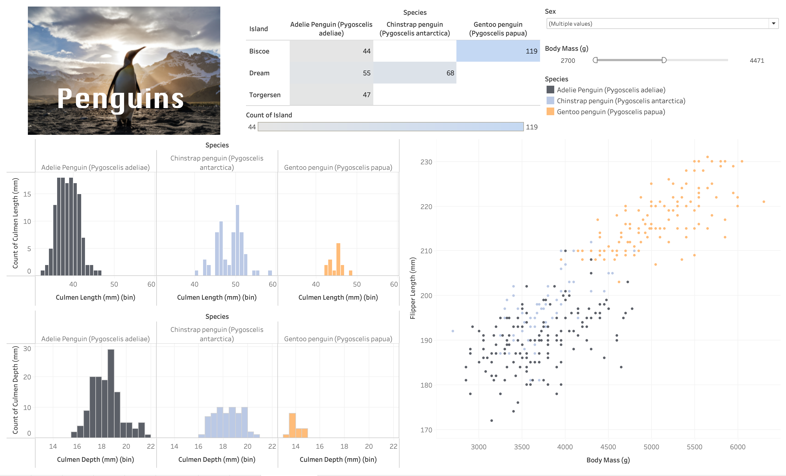

#  Lesson 2: Plots and Dashboards 

This exercise will require you to use the data named [penguins](https://www.kaggle.com/parulpandey/palmer-archipelago-antarctica-penguin-data?select=penguins_lter.csv) that you can find on the google drive [here](https://drive.google.com/file/d/1-KHqO4AEbNmpudl0oW4MCgzYexTZO3MJ/view?usp=sharing). 


## Exercise 1: Loading in the data

1\. Load in the `penguin.csv` data.      
- How many geographical columns are there?
- How many Measures are there?
- How many continuous columns?
- Are any columns generated by Tableau?
- Are there any date fields?
  
Note: There are no "unique" Identifying columns in this dataframe, so when we are using the **count** statistic you can use the **Count** (Not Count distinct) measure of the column you can assess.  

## Exercise 2: Basic plots

1\. Are there any columns that would be appropriate for a pie chart?      
2\. Create a new worksheet and create a Stacked bar chart from the `Species` column.      
3\. Is it easy to see the quantity value of each of the penguin species?     
4\. Convert the stacked bar plot into a side-by-side bar plot.       
- Sort the bars in descending order 
- Add a colour to each species if you want to. 
5\. Open a new worksheet and create a scatterplot between the `Body Mass (g)` and `flipper Length` fields.        
- Change the mark style to a circle and decrease the point size. 
- Add the species field to the colour channel.
- What kind of relationship did you identify? 
- Which penguin species tend to have the greatest flipper length?
6\. Create a line graph that shows the number of egg clutches over the research period.  
- Does the field appear to have a cyclical component? If so, how long is 1 cycle approximately? 
7\. Give all the plots that you made in this exercise appropriate titles and axis names. Change the colours to something you'd prefer. 


## Exercise 3: Creating Distributions 
1\. Create a histogram for the `Culmen Length (mm)` field.
- Change the size of the bins to 1.
- What type of shape does it have? (uniform, bell?)
- How many "peaks" does it have? 
- Add the species dimension to both the **Columns** shelf and the colour channel. Which species tends to have the shortest culmen lengths? 
  
2\. Create a histogram for the `Culmen Depth (mm)` column now. 
- Change the size of the bins to 0.5  now. 
- What is the range of values?
- Add the species dimension to both the **Columns** shelf and the colour channel. Which species tends to have the most shallow culmens? 
  
3\. Now let's try and compare the bodyweight distributions between the penguin sexes using a box plot. Exclude the observation that has an unmarked value by right-clicking it and selecting **Hide**.      
- Are there any outliers displayed as marks on the boxplots? 
- Sort the boxplots in descending order by the median. 
- Which sex has the higher median body mass?

4\. Create a new worksheet and let's create a heatmap between the `Island` and `Species` columns.       
- Which island has only 1 species inhabiting it?
- Which species is only inhabiting on a single island?
- Add the count of the penguins as a label to each mark.
- How many Gentoo penguins are on Biscoe island? 
5\. Give all the plots that you made in this exercise appropriate titles and axis names. Change the colours to something you'd prefer. 


## Exercise 4: Creating Dashboards  

1\. Create a new Dashboard page.
2\. Convert Dashboard **Size** to automatic.     
3\. From the google drive, download this       [image](https://drive.google.com/file/d/10JhxST9v0axsBmKJ4ZR64lVicv8XQyTN/view?usp=sharing) and add it to your dashboard. I recommend to"fit the image"" to the outline.   
4\. Add the scatterplot,the heatmap and both of the histograms to your dashboard.
5\. Create a sex filters for the scatterplot that is in the style of dropdown and you can select multiple categories.       
- Adjust this filter so it works for all the plots.     
6. Create a bodymass filter, that only works on the 2 histograms. 

7\. Create a text box with your Dashboard title and have it "Float" over the image.    


## Attribution

- Data: Gorman KB, Williams TD, Fraser WR (2014) Ecological Sexual Dimorphism and Environmental Variability within a Community of Antarctic Penguins (Genus Pygoscelis). PLoS ONE 9(3): e90081. doi:10.1371/journal.pone.0090081, Obtained from [Kaggle](https://www.kaggle.com/parulpandey/palmer-archipelago-antarctica-penguin-data?select=penguins_lter.csv).

- Image: <a href="https://unsplash.com/@evanescentlight?utm_source=unsplash&utm_medium=referral&utm_content=creditCopyText">Ian Parker</a> on <a href="https://unsplash.com/s/photos/penguins?utm_source=unsplash&utm_medium=referral&utm_content=creditCopyText">Unsplash</a>
  
  
  
## Need a little inspiration? 

Below is a ***very*** rough and quick version of the above activity. Only click to see if you need a little help. 

```{admonition} Hayley's Fast Dash
:class: dropdown



```


