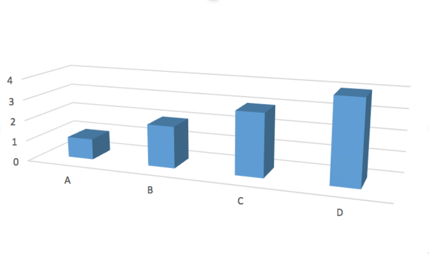
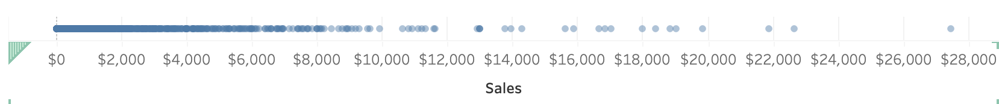

#  Visualization Types 

## Introduction 

In the theory portion of lesson 2, we're going to discuss the different types of visualizations possible and when/how they are used to communicate the data to an audience. 

There are MANY different graphs and unfortunately, we are only going to scrape a small surface. 

A great resource to use to discover different visualization types is [The Data Visualisation Catalogue](https://datavizcatalogue.com/). Now, remember that just because the viz type exists, doesn't necessarily mean it's the most effective plot for communication. 

## Graph Types 

### Area vs Position

First, let's get into channel types. When we make plots we often use either an area or a position channel to represent data. Let's compare how these two channels can impact the efficiency of our interpretation of plots.  

This exercise was replicated from the [Data Visualization](https://viz-learn.mds.ubc.ca/en/module2) course I co-created with [Joel Ostblom](https://joelostblom.com/) where we adapted the examples given from [Jeffrey Heer’s PyData talk](https://www.youtube.com/watch?v=hsfWtPH2kDg). 

First, try to estimate how many times larger circle B is compared to circle A.


<br>
<br>


Not exactly easy is it? Let's try it with bars now. 

How many times *longer* is bar B than bar A?


<br>
<br>

Well, the answer is the same in both examples the bar B is 8 times longer than bar A and circle B is 8 times larger than the area of circle A. 

Even if you were right with both of these estimates, you would have likely found it easier to compare the length of the bars over the area of the circles. The other question that may come to mind is are you supposed to compare diameter, radius, or area? 

With bars, so long are the widths are the same the ambiguity is lower for comparing objects. 

This is something that really should be on your mind when using visualizations to communicate insights.  

### Pie Charts 

A pie chart is a circular graph (a pie 🥧 if you will) that is broken into slices to illustrate the numerical proportion of a whole.

In pie charts, the arc length, angle and area of each slice are proportional to the value it's representing.


Pie charts generally work well when the values are easy fractions like a half or quarter or when the datasets are small but this figure has a bad reputation in data science and is often criticized by experts.  

This communication of information can instead be displayed with either a stacked bar chart or side-by-side bar charts. 


### Stacked Bar Charts 

Stacked bar charts communicate the same information as a pie chart however often it is argued that this is easier to compare values. 

Often stacked bar charts are ideal when there are only two categories since both segments will be easy to compare between categories.


### Side by Side Bars

The last option is if we simply displayed the information using position only and split up the categories into separate bars. 


Here we can see not only the values of each category quickly and clearly but we don't have to do any hard approximation of how many times larger one category is from another. 


### Comparing Pie, Stacked Bar and Side by Side Bar Plots 

Clause Wike has the following useful table from his [Data Viz](https://clauswilke.com/dataviz/visualizing-proportions.html#a-case-for-pie-charts) resource that explains how the 3 types of plots can most effectively be used. 

<table>
<caption><span id="tab:pros-cons-pie-bar">Table from <a href="https://clauswilke.com/dataviz/visualizing-proportions.html#a-case-for-pie-charts">Clause Wilke's</a> </span> pros and cons of common approaches to visualizing proportions: pie charts, stacked bars, and side-by-side bars.</caption>
<colgroup>
<col width="34%">
<col width="21%">
<col width="21%">
<col width="21%">
</colgroup>
<thead>
<tr class="header">
<th></th>
<th align="center">Pie chart</th>
<th align="center">Stacked bars</th>
<th align="center">Side-by-side bars</th>
</tr>
</thead>
<tbody>
<tr class="odd">
<td>Clearly visualizes the data as proportions of a whole</td>
<td align="center">✔</td>
<td align="center">✔</td>
<td align="center">✖</td>
</tr>
<tr class="even">
<td>Allows easy visual comparison of the relative proportions</td>
<td align="center">✖</td>
<td align="center">✖</td>
<td align="center">✔</td>
</tr>
<tr class="odd">
<td>Visually emphasizes simple fractions, such as 1/2, 1/3, 1/4</td>
<td align="center">✔</td>
<td align="center">✖</td>
<td align="center">✖</td>
</tr>
<tr class="even">
<td>Looks visually appealing even for very small datasets</td>
<td align="center">✔</td>
<td align="center">✖</td>
<td align="center">✔</td>
</tr>
<tr class="odd">
<td>Works well when the whole is broken into many pieces</td>
<td align="center">✖</td>
<td align="center">✖</td>
<td align="center">✔</td>
</tr>
<tr class="even">
<td>Works well for the visualization of many sets of proportions or time series of proportions</td>
<td align="center">✖</td>
<td align="center">✔</td>
<td align="center">✖</td>
</tr>
</tbody>
</table>

My simple rule of thumb is when possible use side-by-side plots unless there are 2 categories where you want a quick identification of when a category is greater.

### 3-D

Ahhhh, The 3D plot. We mentioned this very quickly on the very first day of our course and we saw how changing the dimension of a plot visualizing the ESS of blood vessels increased the identification of low ESS from 71% to 91%. 


This alone should be enough of an argument to explain why 3D plots should not be used unnecessarily.

The most common time to avoid 3-dimensional plots is in a bar or pie chart or when you have no way of rotating your plot to see all the views possible. 

Let's look at a clear example where this method is deceiving. 



[Source: Joel Ostblom](https://viz-learn.mds.ubc.ca/en/module2)

The values of each of these bars appear to have the values  A=0.7, B=1.7, C=2.7 and D=3.7.

However, in reality, the true values of A, B, C and D are 1,2,3, and 4 and it's only because of the angle and point of view of the plot, do we see deceiving values. 

This being said, 3D plots can be extremely communicative in animative plots or in topographical maps or when you have control over the view. 

### Scatter Plot

A scatter plot is a type of plot used to visualize 2 columns that both have continuous values.  


Scatter plots are also used to observe relationships between variables.
For example, if when the values of x increases, the y values tend to increase, there appears to be a positive relationship between the 2 columns. 


You'll likely be using these frequently as they are easy to interpret and they also can show the distribution of 2 columns simultaneously. (We will talk a little more about this later.)


### Line Graphs

You'll often see these when trying to visualize time as a variable. Time is a continuous feature usually plotted on the x-axis.

Data is plotted and a line is created to connect the data between intervals. 


Line graphs are quite common in the wild because they are easy to understand.

Rarely, (if ever) will you see line graphs visualizing categorical data. 

Don't mistake line graphs with lines of best fit or trend lines. These are quite different. 


<br>
<br>

A trend line won't connect the data points and instead will find a suitable equation for a line that approximately represents the data as a straight line, whereas line graphs connect the data together. 

### Geographical 

When displaying data with a geospatial component we generally need to use some form of a map. We saw already that Tableau takes coordinates such as latitude and longitude and projects them onto a flat surface. 


<br>
<br>

We also often colour different regions based on specific data values. These are called **Choropleth maps**. We will learn how to make these in Lesson 3. 


<br>
<br>


## Quick Quiz

1. Between area and position, which is generally easier to compare when analyzing?
2. What is the name of the graph we use to compare proportions that is circular in shape? 
3. **True or False:** Plotting in 3D can distort the data depending on the view. 
4. **True or False:** There acceptable times to present a 3D plot.  
5. Which graph is used to visualize how the value of something changes over time?
6. **True or False:** Scatter plots are generally used to visualize the data of 2 discrete variables (columns).  
7. What is the name of a geospatial map where regions and certain areas are coloured or patterned in proportion to a column value or calculation?


<!--
```{admonition} Solutions!
:class: dropdown

1. Position
2. Pie chart
3. True
4. True
5. Line graph
6. False
7. Choropleth maps


```
-->


## Distributions 

Often when we are trying to understand our data better, we dive deeper into particular columns and examine how frequently certain values occur, or the range it spans over. 

Visualizing the distribution of these columns allows us to identify both of these measures. 

### Visualizing a Numeric Column

The simplest way to see how a column from a dataframe is distributed is by plotting all the values on a single axis. 

This is like a single axis of a scatter plot. 


<br>
<br>

Now, this looks fine with a few values but what happens when we have thousands or hundreds of thousands of rows?



<br>
<br>

It's now extremely difficult to make sense of the distribution as the points are all overlapping. 

We call this type of behaviour in plots "over-saturated".

So, what can we use instead? 

#### Histograms 

We can instead group the values into bins and show the number of observations in each bin (the count) on the y-axis. 

This ends up looking like a bar chart but instead of a categorical column on one of the axis, we have displayed our continuous, numeric column into groups. 


<br>
<br>

This distribution could be potentially changed with different axis transformations but we can talk about that later on.

Some distributions have a bell shape distribution which we call "normal". Others can have many peaks or no peaks at all which we would call "uniform".

#### Density 

One of the problems with histograms is that we can vary the shape of the distribution depending on the width we assign to each bin. For example, the bins could be \$100 wide or \$500 wide and our distribution would then change.


<br>
<br>

A histogram is not completely unbiased and when we have a small dataset, this can be much more problematic.

We often use histograms because they have been used for centuries now and easy to draw without too many problems. 

With our new age of technology though, we can use other plotting types that have less bias. 

The density plot is a solution to this!


Density plots visualize uses **kernel smoothing** to visualize the underlying probability distribution of the data.

Essentially we can create bell-shaped bins for the data instead of square ones in the histograms. These bell-shaped bins are called kernels and added up together to give a smooth distribution. 


Although we often call this a "density plot", the proper name is **Kernel Density Estimate** (KDE).

The funny thing about everything we said above is that Tableau does not facilitate the creation of density plots easily. Of course, there are workarounds for this but we have histograms to work with instead. 


### Visualizing 2 numeric columns 

If we want to compare the distributions of 2 numeric columns, the easiest plot to create would simply be a scatter plot! 


We can also see the relationship between the two columns, the frequency of the values of each axis, as well as the range. 


### Visualizing the Distribution of Categorical Columns

We've seen that bar charts work as a method of displaying the number of observations for each category in a categorical column which is somewhat like a distribution but is most commonly referred to as just showing the counts of the categories. 


<br>
<br>

However, this only shows a single value for each category though whether it be the count, mean, median, etc. and we know that can be quite restrictive. It will hide a lot of the variation that may be occurring in the data and potentially lead to incorrect analysis. 

So, what can we use instead? 

#### Box Plot 

A boxplot is a graph that shows some key summary statistics and often outlying individual values.


<br>
<br>

Box plots will show not just the median value, but also the lower and upper quartiles, and often the min and max values or extreme values. 


[Source: https://datavizcatalogue.com](https://datavizcatalogue.com/methods/images/anatomy/box_plot.png)
<br>
<br>

- The middle line represents the data's median value. 
- The box is the data's interquartile range (IQR) which is the 25th to the 75th percentile.
- The **whiskers** often indicates the variability outside the upper and lower quartiles.
- Sometimes outliers are displayed as individual marks. 


#### Violin plot 

Although Tableau isn't capable of making violin plots in an easy straightforward way, it's important that we mention them. 


[Source: https://datavizcatalogue.com](https://datavizcatalogue.com/methods/images/top_images/SVG/violin_plot.svg)
<br>
<br>

Boxplots are effective for showing multiple statistics, however, they are not effective in showing distributions with multiple peaks. 


[Source: Justin Matejka, George Fitzmaurice](https://www.autodesk.com/research/publications/same-stats-different-graphs)
<br>
<br>

Violin plots essentially give us a rotated distribution of the data and help us interpret the data more effectively than a box plot. 


### Visualizing the distribution of 2 Categoric Columns 

Often we may want to see the number of observations that are in 2 specific columns. 

For example, if a movie genre is contained in 1 column, and the rating is a second column, how many movies in our data are of the "Action" genre and are rated 13A? 

You often will have questions that are dependent on knowing how many observations are present in 2 different column categories. 

#### Heatmaps

Heatmaps are a way to effectively visualize the counts of observations from two-dimensional categorical data.


<br>
<br>


In this heatmap, we can see that the consumer segment ships the majority of their orders with Standard Class. In fact, for all segments, Standard Class appears to be the most frequent. 

We can really get a sense of our data when comparing 2 categorical columns, and heatmaps are an effective way to do so, however, they do not give the exact count for each colour tint so adjusting the plot accordingly could sometimes be helpful in some scenarios. 


#### Plots Using Marker Size 

We talked about how relying on a single colour channel to communicate information can pose some problems for those with colorblindness and it's often harder to see small variations in colour as we can with position or size channels. 

To accommodate for these issues, we can either add the values as we showed above or we can use size **AND** colour for these plots. 


<br>
<br>


## Quick Quiz

1. **True or False:** Using the same data, a histogram’s shape can change depending on the bin size.
2. **True or False:** When we are visualizing data from a single column, we are (usually) more interested in the shape/distribution in general, than individual points.
3. What does the middle line of a box plot represent?
4. Which visualization type can show multiple summary statistics of data as well as their distributions?  
5. What is another name for a density plot?
6. What plot type is most appropriate if we are interested in visualizing the relationship between two numeric/quantitative columns?


<!--
```{admonition} Solutions!
:class: dropdown

1. True
2. True
3. Median
4. Violin plot
5. Kernel Density Estimate (KDE)
6. Scatter plot

```
-->


