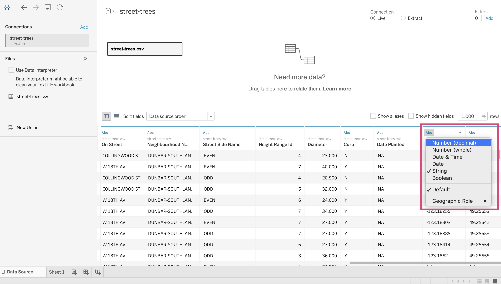
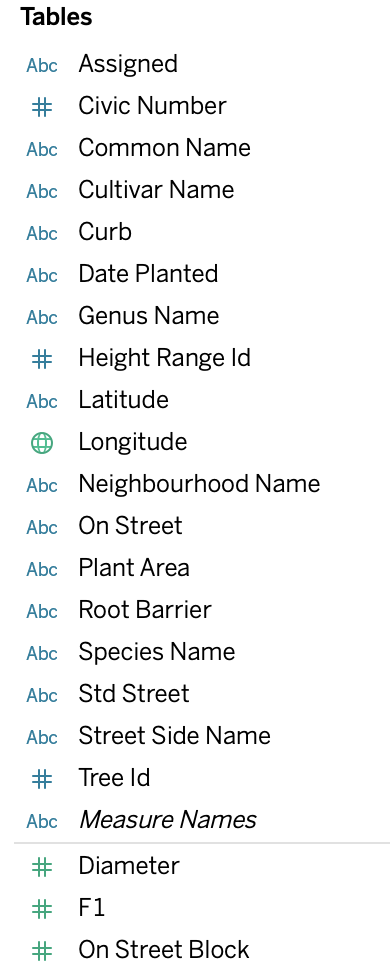
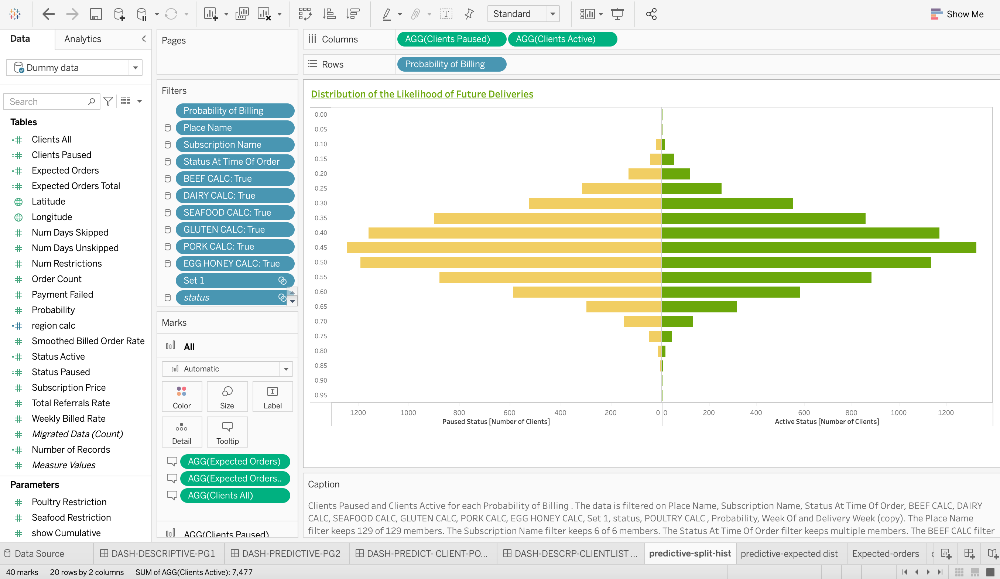
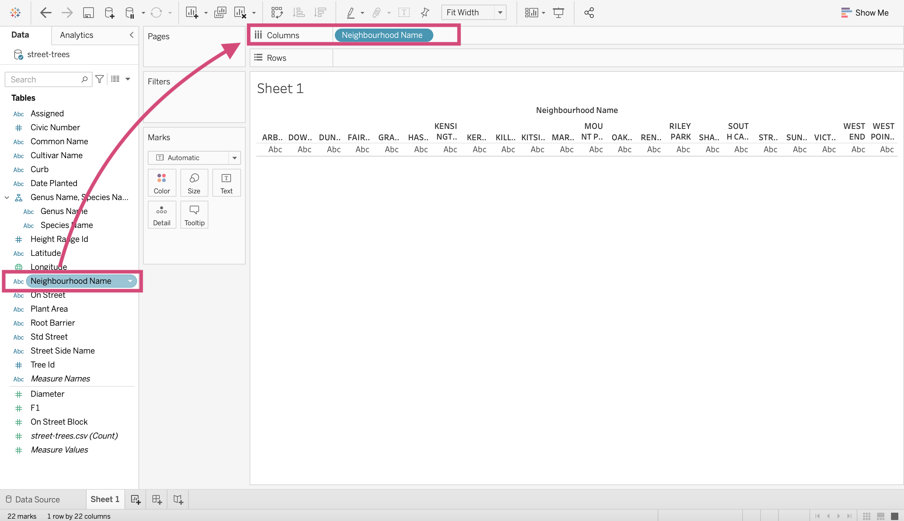
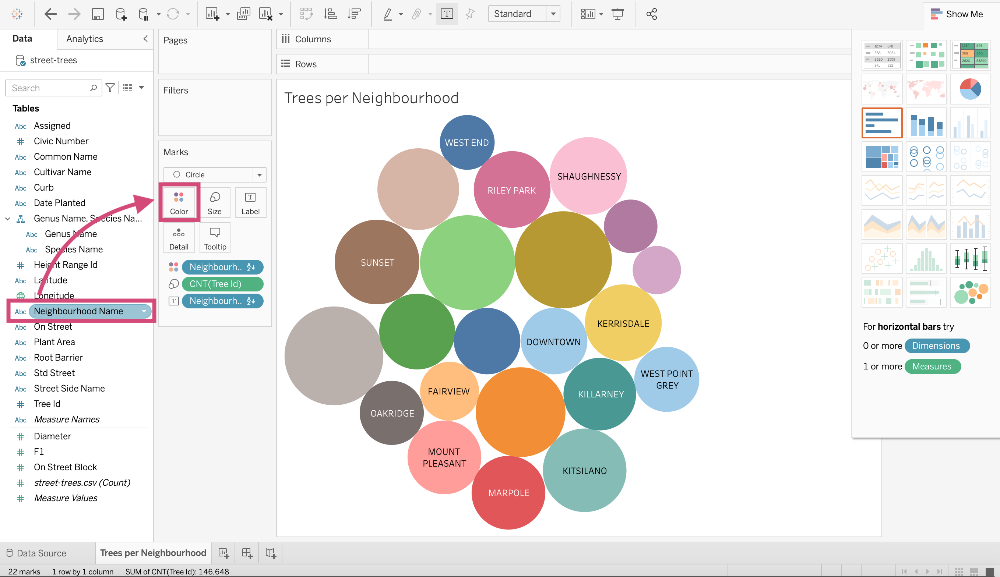
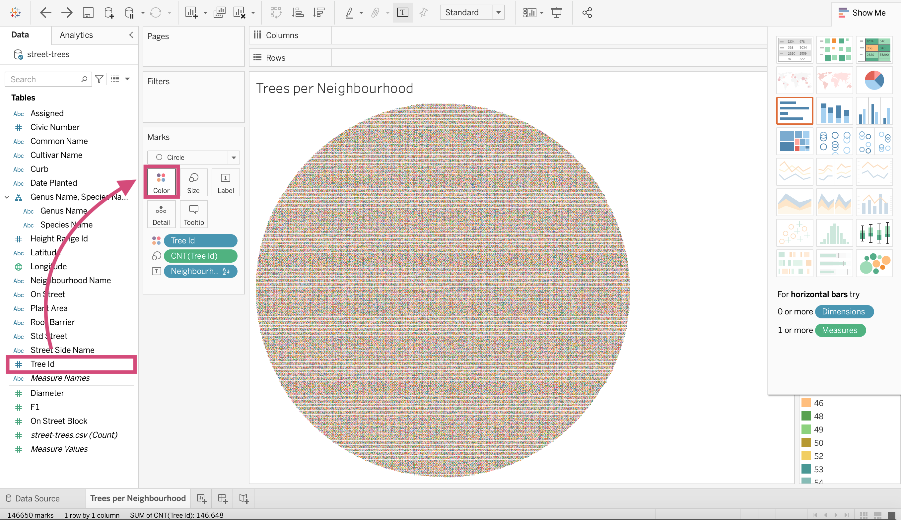
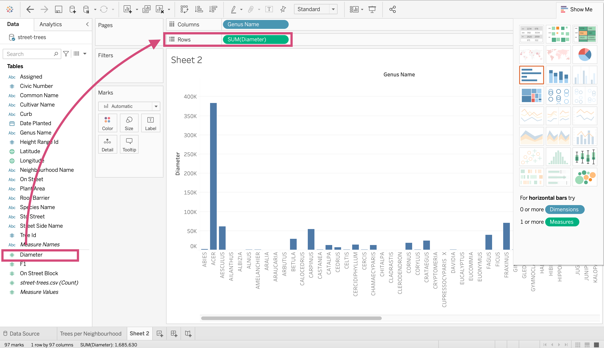

# Introduction to Tableau

## What is Tableau 

By now, you'll know that Tableau is going to help you make sense of your data but how? 

Tableau is a visualization software used in businesses to create static and dynamic plots that can easily be shared within and across organizations.

This software is used by many different occupations such as: 

- Business Analysts
- Data Visualization Analysts
- Data Scientists
- Software developers
- Engineers 

to name a few.

Not only do many different occupations use it but companies ranging in size including giants like:

- Amazon,  Apple, CIBC, Coca-Cola, Lululemon, Lenovo, LinkedIn, PayPal, etc.


## Tableau Examples 

I guess it would be nice to know why right? Well, Tableau makes some beautiful visualizations.

Here is a dashboard I made for the company "Fresh Prep" that you can explore on [Tableau public](https://public.tableau.com/app/profile/hayley2039/viz/2020-06-02-dummy/DASH-PREDICTIVE-PG2).

<div class='tableauPlaceholder' id='viz1624349477125' style='position: relative'><noscript><a href='#'></a></noscript><object class='tableauViz'  style='display:none;'><param name='host_url' value='https%3A%2F%2Fpublic.tableau.com%2F' /> <param name='embed_code_version' value='3' /> <param name='path' value='shared&#47;99FSXFSFM' /> <param name='toolbar' value='yes' /><param name='static_image' value='https:&#47;&#47;public.tableau.com&#47;static&#47;images&#47;99&#47;99FSXFSFM&#47;1.png' /> <param name='animate_transition' value='yes' /><param name='display_static_image' value='yes' /><param name='display_spinner' value='yes' /><param name='display_overlay' value='yes' /><param name='display_count' value='yes' /><param name='language' value='en-US' /></object></div>                <script type='text/javascript'>                    var divElement = document.getElementById('viz1624349477125');                    var vizElement = divElement.getElementsByTagName('object')[0];                    if ( divElement.offsetWidth > 800 ) { vizElement.style.width='100%';vizElement.style.height=(divElement.offsetWidth*0.75)+'px';} else if ( divElement.offsetWidth > 500 ) { vizElement.style.width='100%';vizElement.style.height=(divElement.offsetWidth*0.75)+'px';} else { vizElement.style.width='100%';vizElement.style.height='2127px';}                     var scriptElement = document.createElement('script');                    scriptElement.src = 'https://public.tableau.com/javascripts/api/viz_v1.js';                    vizElement.parentNode.insertBefore(scriptElement, vizElement);                </script>

<br>

This took around 5 weeks and note that you are seeing the dashboard using fake data. 

This is just the tip of the iceberg though. 

Let's take a look at a few exceptionally beautiful examples. 

### [bo Burnham INSIDE by Joshua Preston](https://public.tableau.com/app/profile/joshpreston/viz/boburnhaminside/Dashboard1)

<div class='tableauPlaceholder' id='viz1624325919060'  style='width: 400; height: 600; style='position: relative'><noscript><a href='#'></a></noscript><object class='tableauViz'  width='30%' height='70%' style='display:none;'><param name='host_url' value='https%3A%2F%2Fpublic.tableau.com%2F' /> <param name='embed_code_version' value='3' /> <param name='site_root' value='' /><param name='name' value='boburnhaminside&#47;Dashboard1' /><param name='tabs' value='no' /><param name='toolbar' value='yes' /><param name='static_image' value='https:&#47;&#47;public.tableau.com&#47;static&#47;images&#47;bo&#47;boburnhaminside&#47;Dashboard1&#47;1.png' /> <param name='animate_transition' value='yes' /><param name='display_static_image' value='yes' /><param name='display_spinner' value='yes' /><param name='display_overlay' value='yes' /><param name='display_count' value='yes' /><param name='filter' value='mobile=' /><param name='language' value='en' /></object></div>                <script type='text/javascript'>                    var divElement = document.getElementById('viz1624325919060');                    var vizElement = divElement.getElementsByTagName('object')[0];                    vizElement.style.width='820px';vizElement.style.height='1000px';                    var scriptElement = document.createElement('script');                    scriptElement.src = 'https://public.tableau.com/javascripts/api/viz_v1.js';                    vizElement.parentNode.insertBefore(scriptElement, vizElement);                </script>

### [Demo wealth and banking - Manager view by Ellen Blackburn](https://public.tableau.com/app/profile/ellen4268/viz/Demowealthandbanking-Managerview/BankingDemo-Managerview3)
<div class='tableauPlaceholder' id='viz1624325942676'  style='width: 700; height: 600; style='position: relative'><noscript><a href='#'></a></noscript><object class='tableauViz'  width='90%' height='100%' style='display:none;'><param name='host_url' value='https%3A%2F%2Fpublic.tableau.com%2F' /> <param name='embed_code_version' value='3' /> <param name='site_root' value='' /><param name='name' value='Demowealthandbanking-Managerview&#47;BankingDemo-Managerview3' /><param name='tabs' value='no' /><param name='toolbar' value='yes' /><param name='static_image' value='https:&#47;&#47;public.tableau.com&#47;static&#47;images&#47;De&#47;Demowealthandbanking-Managerview&#47;BankingDemo-Managerview3&#47;1.png' /> <param name='animate_transition' value='yes' /><param name='display_static_image' value='yes' /><param name='display_spinner' value='yes' /><param name='display_overlay' value='yes' /><param name='display_count' value='yes' /><param name='filter' value='mobile=' /><param name='language' value='en' /></object></div>                <script type='text/javascript'>                    var divElement = document.getElementById('viz1624325942676');                    var vizElement = divElement.getElementsByTagName('object')[0];                    if ( divElement.offsetWidth > 800 ) { vizElement.style.width='820px';vizElement.style.height='800px';} else if ( divElement.offsetWidth > 500 ) { vizElement.style.width='820px';vizElement.style.height='702px';} else { vizElement.style.width='100%';vizElement.style.height='3677px';}                     var scriptElement = document.createElement('script');                    scriptElement.src = 'https://public.tableau.com/javascripts/api/viz_v1.js';                    vizElement.parentNode.insertBefore(scriptElement, vizElement);                </script>

### [Dinosaur2 by Rahul Patil](https://public.tableau.com/app/profile/rahul7922/viz/Dinosaur2_16228076369930/Dinosaur)
<div class='tableauPlaceholder' style='width: 700; height: 600; style='position: relative' id='viz1624324606775'><noscript><a href='#'></a></noscript><object class='tableauViz'  width='90%' height='100%' style='display:none;'><param name='host_url' value='https%3A%2F%2Fpublic.tableau.com%2F' /> <param name='embed_code_version' value='3' /> <param name='site_root' value='' /><param name='name' value='Dinosaur2_16228076369930&#47;Dinosaur' /><param name='tabs' value='no' /><param name='toolbar' value='yes' /><param name='static_image' value='https:&#47;&#47;public.tableau.com&#47;static&#47;images&#47;Di&#47;Dinosaur2_16228076369930&#47;Dinosaur&#47;1.png' /> <param name='animate_transition' value='yes' /><param name='display_static_image' value='yes' /><param name='display_spinner' value='yes' /><param name='display_overlay' value='yes' /><param name='display_count' value='yes' /><param name='filter' value='mobile=' /><param name='language' value='en' /></object></div>                <script type='text/javascript'>                    var divElement = document.getElementById('viz1624324606775');                    var vizElement = divElement.getElementsByTagName('object')[0];                    vizElement.style.width='820px';vizElement.style.height='800px';                    var scriptElement = document.createElement('script');                    scriptElement.src = 'https://public.tableau.com/javascripts/api/viz_v1.js';                    vizElement.parentNode.insertBefore(scriptElement, vizElement);                </script>

### [The History of 6+ Magnitude Earthquakes in years 1900-2013 by Marcin Pielużek](https://public.tableau.com/app/profile/marcin3282/viz/TheHistoryof6MagnitudeEarthquakesinyears1900-2013/Dashboard1)

<div class='tableauPlaceholder' id='viz1624326049667'  style='width: 700; height: 600; style='position: relative'><noscript><a href='#'></a></noscript><object class='tableauViz'  width='30%' height='60%' style='display:none;'><param name='host_url' value='https%3A%2F%2Fpublic.tableau.com%2F' /> <param name='embed_code_version' value='3' /> <param name='site_root' value='' /><param name='name' value='TheHistoryof6MagnitudeEarthquakesinyears1900-2013&#47;Dashboard1' /><param name='tabs' value='no' /><param name='toolbar' value='yes' /><param name='static_image' value='https:&#47;&#47;public.tableau.com&#47;static&#47;images&#47;Th&#47;TheHistoryof6MagnitudeEarthquakesinyears1900-2013&#47;Dashboard1&#47;1.png' /> <param name='animate_transition' value='yes' /><param name='display_static_image' value='yes' /><param name='display_spinner' value='yes' /><param name='display_overlay' value='yes' /><param name='display_count' value='yes' /><param name='filter' value='mobile=' /><param name='language' value='en' /></object></div>                <script type='text/javascript'>                    var divElement = document.getElementById('viz1624326049667');                    var vizElement = divElement.getElementsByTagName('object')[0];                    if ( divElement.offsetWidth > 800 ) { vizElement.style.width='820px';vizElement.style.height='820px';} else if ( divElement.offsetWidth > 500 ) { vizElement.style.width='820px';vizElement.style.height='800px';} else { vizElement.style.width='100%';vizElement.style.height='5027px';}                     var scriptElement = document.createElement('script');                    scriptElement.src = 'https://public.tableau.com/javascripts/api/viz_v1.js';                    vizElement.parentNode.insertBefore(scriptElement, vizElement);                </script>


### [Piano Classroom by Nir Smilga](https://public.tableau.com/app/profile/nir.smilga/viz/PianoClassroom/PianoClassroom)
<div class='tableauPlaceholder' id='viz1624326079002'  style='width: 700; height: 600; style='position: relative'><noscript><a href='#'></a></noscript><object class='tableauViz'  width='90%' height='100%' style='display:none;'><param name='host_url' value='https%3A%2F%2Fpublic.tableau.com%2F' /> <param name='embed_code_version' value='3' /> <param name='site_root' value='' /><param name='name' value='PianoClassroom&#47;PianoClassroom' /><param name='tabs' value='no' /><param name='toolbar' value='yes' /><param name='static_image' value='https:&#47;&#47;public.tableau.com&#47;static&#47;images&#47;Pi&#47;PianoClassroom&#47;PianoClassroom&#47;1.png' /> <param name='animate_transition' value='yes' /><param name='display_static_image' value='yes' /><param name='display_spinner' value='yes' /><param name='display_overlay' value='yes' /><param name='display_count' value='yes' /><param name='filter' value='mobile=' /><param name='language' value='en' /></object></div>                <script type='text/javascript'>                    var divElement = document.getElementById('viz1624326079002');                    var vizElement = divElement.getElementsByTagName('object')[0];                    vizElement.style.width='820px';vizElement.style.height='820px';                    var scriptElement = document.createElement('script');                    scriptElement.src = 'https://public.tableau.com/javascripts/api/viz_v1.js';                    vizElement.parentNode.insertBefore(scriptElement, vizElement);                </script>


To see more, go to [Tableau's Feature Gallery](https://public.tableau.com/en-us/gallery/?tab=featured&type=featured)

## History of Tableau 

Tableau was founded in 2003 in California (classic).  

Recently in 2019, the company was acquired by Salesforce for $15.7 billion just giving a little reference about how valuable this tool is considered. 

Normally this wouldn't be too important but I do want you to know the expertise that this software is built by and why it is credible.

There are 3 main characters involved: 


**Chris Stolte who is the Co-founder and technical advisor**
- Ph.D. in Computer Science (from Stanford University)
- Co-inventor on five software patents related to information visualization


**Pat Hanrahan who is the Co-founder and Chief Scientist** 
- A founding employee at Pixar Animation Studios
- Received three Academy Awards for his work in rendering and computer graphics research
- Professor of Computer Science and Electrical Engineering at Stanford University, teaching computer graphics

  

**Christian Chabot, who is the Co-founder and chairman** 
- MBA from Stanford University
- CEO and co-founder of BeeLine Software, a pioneer of next-generation digital mapping technology


The short story of this is that Tableau is built by some very talented individuals. 


## Other Similar Tools Available

- Microsoft PowerBI (sold as part of a Microsoft package)
- Looker (Owned by Google)
- QlikView
- Domo
- many, many others...

## Pros and Cons


## Version Control?

A slight setback if you do not have a Tableau Server. 


## Where is visualization situated in the grand scheme of data science? 

- Visualization can absolutely be an end-goal! 
- Visualization dashboards can be used to target individuals for sales, find shortcomings in production, as well as help, identify trends in the data which can help with a prediction component. 

## Quick Quiz

1. What must you have in order for us to have some form of version control beyond saving files with different names?
2. Who is Tableau's Co-founder and technical advisor?
3. Name me a company that uses Tableau.
4. What visualization tool was acquired by Google?
5. **True or False:** You must have some coding experience to use Tableau. 


```{admonition} Solutions!
:class: dropdown

1. Tableau Server
2. Chris Stolte
3. Amazon, Apple, CIBC, Coca-Cola, Lululemon, Lenovo, LinkedIn, PayPal, Nokia Dell, Lenovo, Cisco, Forbes, eBay, Intel, Ferrari, Deloitte etc. 
4. Looker
5. False

```

## Getting Started 

First, let's open up the application. I'll be using the software installed on my computer.


<br>
<br>

You can also use [Tableau public](https://public.tableau.com/en-us/s/) which is a free version of Tableau that allows you to use most of the software functions. The biggest downside is it does not let you save your work locally.

When you open it, you'll be greeted with the home screen. I have a few projects already on the go but you'll have your own as well. 


## Connecting to Data 

Tableau lets you either connect to a database server or upload a file. We are going to discuss one of each. 


### Connecting to MySQL Server

The most occurring database server and the example we are going to show you here is MySQL. 

Clicking ***MySQL*** for the first time results in the following popup.


<br>
<br>


<br>
<br>

You'll have to follow the instructions [here](https://www.tableau.com/support/drivers?edition=pro&lang=en-us&platform=mac&cpu=64&version=2021.1&__full-version=20211.21.0511.0935#mysql) and make sure you downloaded the 2 necessary packages in order for Tableau to connect. 

Once you've installed them, you'll have to close Tableau and reopen it. 

Now when you click on ***MySQL***, you will have the new popup where you'll have to put the required information to your server. 


<br>
<br>

Note that there are MANY other servers that are options. Simply click ***More...*** under the "To a Server" heading and take your pick!


## csv, excel, etc. 

In addition to Tableau connecting to a server, there are a multitude of file types Tableau can upload. The major types are CSVs, excel files, JSON files etc. to upload, we can simply use the ***More...*** under the "To a File" heading. 


<br>
<br>

We are going to use a CSV named `street-trees.csv` for our demo. 

Locate your file and click ***Open***.

I'll be using the `street-trees.csv` file located in this [Google Drive file](https://drive.google.com/drive/folders/1IP1Vs8bJnGElKfqZ8VkNlLVX-VXJZfaV)


<br>
<br>

After you've selected you'll be directed to a new screen where you'll be asked to ***Update now*** or ***Automatically Update***. I generally select the former. 


<br>
<br>

This will now give you a view of the data that the csv has to offer. 


<br>
<br>

This is where you'll see some symbols on top of each column. 


<br>
<br>

What are these? 

## Introduction to data types

Each column in your data will have a data type. This represents the kind of information that is stored in a column. 

Tableau will designate a data type when you connect to a source. 

The data types offered in Tableau are as follows: ([source](https://help.tableau.com/current/pro/desktop/en-us/datafields_typesandroles_datatypes.htm)). 

<table cellspacing="0" class="TableStyle-Basic-Border" style="margin-left: 0px; margin-right: auto;"><colgroup><col class="TableStyle-Basic-Border-Column-Column1" style="width: auto;"> <col class="TableStyle-Basic-Border-Column-Column1" style="width: auto;"></colgroup><thead><tr class="TableStyle-Basic-Border-Head-Header1"><th class="TableStyle-Basic-Border-HeadE-Column1-Header1">Icon</th> <th class="TableStyle-Basic-Border-HeadD-Column1-Header1">Data type</th></tr></thead> <tbody><tr class="TableStyle-Basic-Border-Body-Body1"><td class="TableStyle-Basic-Border-BodyE-Column1-Body1"></td> <td class="TableStyle-Basic-Border-BodyD-Column1-Body1">Text (string) values</td></tr> <tr class="TableStyle-Basic-Border-Body-Body1"><td class="TableStyle-Basic-Border-BodyE-Column1-Body1"></td> <td class="TableStyle-Basic-Border-BodyD-Column1-Body1">Date values</td></tr> <tr class="TableStyle-Basic-Border-Body-Body1"><td class="TableStyle-Basic-Border-BodyE-Column1-Body1"></td> <td class="TableStyle-Basic-Border-BodyD-Column1-Body1">Date &amp; Time values</td></tr> <tr class="TableStyle-Basic-Border-Body-Body1"><td class="TableStyle-Basic-Border-BodyE-Column1-Body1"></td> <td class="TableStyle-Basic-Border-BodyD-Column1-Body1">Numerical values</td></tr> <tr class="TableStyle-Basic-Border-Body-Body1"><td class="TableStyle-Basic-Border-BodyE-Column1-Body1"></td> <td class="TableStyle-Basic-Border-BodyD-Column1-Body1">Boolean values (relational only)</td></tr> <tr class="TableStyle-Basic-Border-Body-Body1"><td class="TableStyle-Basic-Border-BodyE-Column1-Body1"></td> <td class="TableStyle-Basic-Border-BodyD-Column1-Body1">Geographic values (used with maps)</td></tr> <tr class="TableStyle-Basic-Border-Body-Body1"><td class="TableStyle-Basic-Border-BodyB-Column1-Body1"></td> <td class="TableStyle-Basic-Border-BodyA-Column1-Body1">Cluster Group (used with <a href="clustering.htm" target="_blank" class="MCXref xref">Find Clusters in Data<span class="sr-only">(Link opens in a new window)</span></a>)</td></tr></tbody></table>

<br>
<br>

Note that generally speaking Tableau will guess which type goes with each column but you'll soon find out that Tableau isn't always right. For example, the column `Date Planted` should be changed to a "Date" data type and `Longitude` and `Latitude` should be both be Geographic data types. 


<br>
<br>

The good news is this is easy to fix! 

Let's convert the column `Date Planted` first.     
Simply click on the icon (ABC in this case) and select the desired type. We are changing this to a date. 


<br>
<br>

To convert the columns `Longitude` and `Latitude` will take 2 steps instead. 

We can't convert it straight to a geographical location since `Longitude` or `Latitude` isn't an option when the column is of type string. 


<br>
<br>

So, we need to change it to a "Number (decimal)" first! 



<br>
<br>

Once the column is a number, we can then select the appropriate `Longitude` option under the Geographical Location menu.


<br>
<br>

Ta-Da! Now we have the appropriate globe icon, meaning the column is now a Geographical data type. 


<br>
<br>


We will have to repeat this for the `Latitude` column now. 


## Tableau Setup

Let's stop playing with our data for a second and get into the actual visualization screen! 

Clicking on ***Sheet 1*** will take us to a worksheet where we can make our first plot. 


<br>
<br>


<br>
<br>

### Workspace

Tableau has a great [image](https://help.tableau.com/current/pro/desktop/en-us/environment_workspace.htm) that will help you identify what you need in your workspace but here is my version. 


<br>
<br>

 : On the top left of the workspace you'll see this symbol, this will take you back to the home page that displays all your projects. 


<p style="font-size:30px; color:#9929BD">Toolbar</p>

I'm not showing all the options but the ones you'll use often. 


<br>
<br>

<p style="font-size:30px; color:#D54A7A">Shelves</p>


This is essentially your x and y-axis and where you can designate one of your data source's columns. 

<p style="font-size:30px; color:#77BB41">Cards</p>

Assigning columns to cards can build on your visualization by encoding marks with colour, size, shape, text, and details like hovers.


<p style="font-size:30px; color:#C4BC00">Viz Area</p>

Also known as the **"View"**, this is exactly what it sounds like; this is where your visualization will be displayed. 


<p style="font-size:30px; color:#3A88FE">Show Me Window</p>

This is going to be a really useful window when you first start using Tableau. If you have already selected columns in any of the shelves or cards, Tableau will give you the option of several types of graphs that could be appropriate for the columns selected. It will also highlight the graph type that best matches the data.


<p style="font-size:30px; color:#00FDFF">Data or Analytics Pane</p>

This is going to be a busy pane for you. Here is where all your data columns are displayed. Your columns are split into 2 different types (with the possibility of more) and 2 different colours. What do they mean though?!

### Data Pane 

#### Dimensions vs Measures 

There is a faint line that splits the columns from the data source into 2 categories.
- **Dimensions** and,
- **Measures**


<br>
<br>

Tableau describes **Dimensions** as "qualitative values (such as names, dates, or geographical data)" whereas **Measures** are numeric, quantitative values. 

This is important to know since sometimes you'll have to switch a column to be expressed as one or the other which it may not have automatically been defaulted to.

#### Continuous vs Discrete columns



<br>
<br>

Have you notices there are 2 different colours of icons? 


<span style="color:#48A67F">Green</span> measures and dimensions means the field (column) is being expressed in a continuous manner.
Continuous data is data that can take on any possible value. An example would be a person's height or the time it takes to microwave popcorn. 

<span style="color:#5794AD; page-break-inside: avoid;">Blue</span> measures and dimensions means the field (column) is being expressed discretely. 
Discrete data can only take certain values. Examples include the number of employees at a company. We can't really have half an employee; would that be the left or the right side?  Or the number of vehicles each company produces on a yearly basis. 

### Calculations, Sets, Parameters
You'll possible have to make other data types besides dimensions and measures such as 

Calculation: These are values or calculations from existing columns that are not currently in your data source. 
You can create these new fields using a formula, calculating the values and saving them as part of your data.

Sets: A section of the data that you define from a column from your data source and a desired criteria. 
For example, you may want a subsection of the data that doesn't include retail customers and only corporate customers. 

Parameters: These are values that can be used as placeholders in formulas for calculations and filters.

We may touch on this later on, but for now, let's move on. 


### Worksheets vs Dashboards vs Story


<br>
<br>

<p style="font-size:30px; color:#D54A7A">Worksheet</p>




<br>
<br>

This is where you create each individual visualization. You create 1 viz per worksheet. 

<p style="font-size:30px; color:#9929BD">Dashboard</p>


<br>
<br>

A dashboard is where you lay out your different worksheets and add any filtering toggles that want to make available for the user. 

You can only add worksheets that have been already made. That means that if you want to add a graph to a dashboard, you have to first make it from a worksheet. 

It's likely as well that you'll have more worksheets and graphs than you want to place in your dashboard. We will talk a little bit more about this in our section on Exploratory Data Visualization. 

<p style="font-size:30px; color:#00C7FC">Story</p>


<br>
<br>

A sequence of worksheets or dashboards that work together to tell a story.

You can create stories to tell a data narrative, provide context, demonstrate how decisions relate to outcomes, or simply make a compelling case.

Each individual sheet in a story is called a story point. 

We will discuss more on the importance of storytelling later on in this course, but this will likely be one of the tabs you use less frequently. 

## Quick Quiz

1. **True or False:** Connecting to a MySQL server is relatively simple. 
2. Tableau sorts data columns into how many different data types?
3. Which of the following is not part of the Tableau Workspace: Toolbar, Cards, Data Pane, Calculation Keys, Show Me Window. 
4. What is the difference between Dimensions and Measures? 
5. **True or False:** Columns that are blue are continuous data, whereas columns in green are discrete. 


```{admonition} Solutions!
:class: dropdown

1. True
2. 7
3. Calculation Keys
4. Dimensions are qualitative fields and Measures and quantitative fields. 
5. False

```

## Making some Viz! (It's about time!)

### Bar

Our question that we want to answer with this plot is ***how many trees there are in each Vancouver neighbourhood?*** 

**Step by Step Instructions**


1\. We are going to drag from the left-hand side under the heading "Tables" the column named `Neighbourhood Name` to the **Column** shelf.



<br>
<br>

2\. We are interested in the count of trees in each neighbourhood. We don't have a count of trees as a column, but since the column `Tree Id` is unique (that means that every row in the data has a different value for `Tree Id`) we can use it to count the rows (you can use multiple different columns here though). Let's drag the `Tree Id` column from the left of the screen to the **Rows** shelf.


<br>
<br>

3\. We need to convert this `Tree Id` variable to a "Measure" specifically a "Count" so that we get 1 value for each neighbourhood. We can do this by right-clicking on it and selecting **Count**.


<br>
<br>

Voila! A bar chart!


<br>
<br>

4\. Let's change the colour. Go to the **Marks** card and select a new colour.


<br>
<br>

5\. Let's edit our y-axis label. Right-click on the axis and click "Edit Axis..."


<br>
<br>

 Under "Axis", you can edit your axis "Title".
 
 

<br>
<br>

You can edit the title of the graph in two ways;

- By editing the title or...

 

<br>
<br>


- By editing the sheet name by double-clicking the sheet at the bottom. (I prefer this way)


<br>
<br>


<br>
<br>

6\. You can sort the bars by clicking the icon beside the axis title or the icon in the toolbar. 


<br>
<br>

7\. Let's convert it to a vertical bar chart. On the toolbar right above **Columns** you'll see a *Swap rows and columns** icon. This transposes your graph.


<br>
<br>

### Bubble

To answer the same question, we could also have done a bubble chart.  

**Step by Step Instructions**


1\. Click on the **Show Me** in the top right corner of the workspace.


<br>
<br>

2\. This will drop down other suggested plots for the measures and dimensions we have dragged to the **Columns** and **Rows** shelves.

Select the bubble diagram that's at the bottom right of the **Show Me** menu.


<br>
<br>

And Voila! Bubble plot! Easy as that! 


<br>
<br>

It would be nice to add some colour no? 

4\. To add colour to a field, we can drag it to the colour option on the **Marks** card. Here we are dragging `Neighbourhood Name`.



<br>
<br>

This was a problematic choice though, there seem to be duplicate colours and it's not an effective colour channel. 

5\. Let's remove the `Neighbourhood Name` from the colour channel by right-clicking it in the **Marks** card and selecting **Remove** from the dropdown menu.


<br>
<br>

 

6\.  Let's instead drag the `Tree Id` column to the colour channel. 



<br>
<br>

Now, this looks bad but we want the count of trees to be represented by a colour scale. 

7\. We can change this by right-clicking `Tree Id` in the **Marks** card and converting it to a **Count** Measure. 


<br>
<br>

8\. Now we can see that the number of trees in each neighbourhood is not only represented by the size of each bubble but also the colour.  The scale on the right side of the plot gives us an idea of how the colour translate to quantity.  


<br>
<br>


### Highlight Table

We could also do a "highlight table" to answer this question as well. 

**Step by Step Instructions**

1\. Let's go back to the **Show Me** menu and click the highlight table option. 


<br>
<br>

And we are done! That's all 1 step needed! 

### Making a New Worksheet

To create a new viz we need to make a new worksheet. We can do this in 2 ways: 

1. by clicking the dropdown menu on the icon in the toolbar and selecting **New Worksheet**

2. Clicking the icon at the bottom left of the workspace. 


<br>
<br>


### Aggregation Plots 

This is very similar to how you would make a COUNT bar plot with one minor difference; we no longer are using a "Count" **Measure** but instead perhaps **Average**, **Median**, **Max** and **Min**.

Our question now is: ***What is the average diameter of each tree genus?***.

**Step by Step Instructions:**

1\. Drag from the left-hand side under the heading "Tables" the column named `Genus Name` to the **Columns** shelf.


<br>
<br>

2\.We want the mean diameter for each genus so we can drag diameter to the **Rows** shelf.



<br>
<br>

3\.This is where things differ. We right-click the diameter and transform it to a **Measure** specifying **Average**.


<br>
<br>

4\.Instead of using a bar chart, Maybe using a dot plot would be more ideal. We can convert it by clicking the dropdown menu under the "Marks" card. Selecting "Circle" or "Shape" will instantly convert it.


<br>
<br>


<br>
<br>

5\. I am going to rotate the axis since I find this to be a more effective plot. 


<br>
<br>


```{admonition} Tip!
:class: tip
You can add your own shape icons by adding a folder to your "My Tableau Repository" folder under "Shapes". 

We will show you how to do this in Class 3 or 4. 
```


### Drill Down and hierarchies  

You'll notice that with this tree data a tree can have a Genus and a species. There are multiple species in each genus. 

We can create a hierarchy from these columns so that we can make a "Drilling down" action between each field in the graph. 


<br>
<br>

1\. First, we identify the second step in our hierarchy and drag it under the field that it encompasses. 


<br>
<br>

For us, this means dragging `Species Name` under `Genus Name`. 


<br>
<br>

2\. This will produce a popup to create the hierarchy. You can name this anything from Tree types or as we did simply the steps in the Hierarchy.  


<br>
<br>

3\. Once the hierarchy is made, you'll see the steps under the title you just wrote as well as a small + icon next to the `Genus Name` field in the **Rows** shelf.


<br>
<br>

4\. If we click the plus next to `Genus Name` species will populate beside it.


<br>
<br>

5\.  The graph will now reflect the hierarchy and sort the trees accordingly.   


<br>
<br>

### Maps 

Maps seem to be pretty intimidating as they can be complex and provide a lot of information in a small space. Luckily for us, maps can be quick friendly and easy to do with Tableau. 

**Step by Step Instructions** 
1\. Drag `Longitude` to the **Columns** shelf.


<br>
<br>

2\. Drag `Latitude` to the **Rows** shelf.


<br>
<br>

And you have made a map with all the trees! 

```{warning}
This won't work so easily if you have not specified a geographical datatype for the columns. 
```

```{admonition} Tip!
:class: tip
If you don't have latitude and longitude columns, you may still be able to make a map if you have any of the following geographical data types that you can designate to the column. 
- Airport	
- US telephone Area Code 
- U.S. Core Based Statistical Areas (CBSA)
- Country/Region
- County (U.S. counties, French départements, German kriese, etc.)
- NUTS Europe
- State/Province	
- Code/Postcode
```

3. Let's tidy this up a bit though. Decrease the size of your markers by clicking the **Size** icon under the **Marks** card.  


<br>
<br>

4. Right-click the map and select **Map Layers...** from the dropdown. This gives you the ability to customize the appearance of your map. 


<br>
<br>


5\. Change the map *Style* to **Normal**. 


<br>
<br>


6\. Add opacity to the map with **Washout**.


<br>
<br>


7\. Add different Map Layers such as **Streets, Highways, Routes** and **Zip Code Boundaries**.


<br>
<br>

    
8\. Add a title like you've done before and you've got a functioning map in < 5 mins. 


<br>
<br>


## Distributing and Saving

We can save our work by clicking the floppy disk icon on the top left of the toolbar. 


<br>

### Workbook (`.twb`)

Tableau by default will save all your sheets and dashboards as a workbook, a `.twb` file. 

This does require you to connect to the data source locally. 

If you send this to colleagues, you will need to send them the data you used, along with any images or additional files you used in your dashboard or worksheets. 

You're more likely to use this is you are using dynamic data. This means that you are connected to a data source that updates regularly.

### Packaged Workbook (`.twbx`)

Instead, you could save your work as a packaged workbook where now all of the files and data sources used are contained in the space. The extension for this file type is `.twbx`. 

That means the workbook is no longer linked to the original data source or images. 

If you are working with static data or want to send your colleague your dashboard as a sample, this is likely the better option! Just remember that this format will take up more storage space. 


## Quick Quiz

1. Where can we find the button/tool necessary to sort your plot?
2. What is one way we can convert a dimension to a measure? 
3. **True or False:** When using the "Show me" window and changing the graph to a different type, the fields can change shelves and/or from dimensions or measures. 
4. **True or False:** It's important that every plot has a dimension/measure in the Columns and Rows shelves.  
5. Which file extension does not save the data in the workbook?


```{admonition} Solutions!
:class: dropdown

1. In the toolbar or by clicking the sort icon on the axis of the plot.
2. Right-clicking and selecting the appropriate statistic. We can also right-click and convert them in the Data pane. 
3. True
4. False
5. `.tbw`

```

